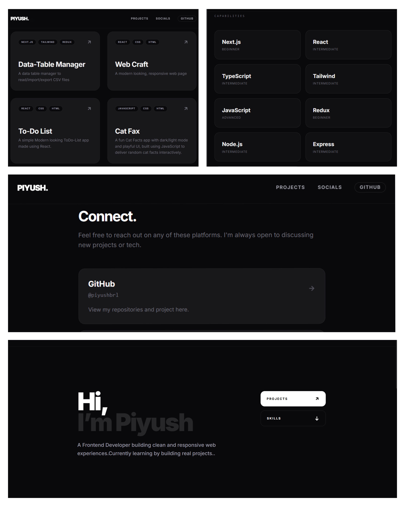

# 🌑 Minimalist Developer Portfolio

A high-performance, responsive portfolio built with a focus on clean typography, minimalist interfaces, and a sophisticated "Midnight Dark" aesthetic.

## ✨ Key Features

- **Midnight Dark Aesthetic**: A custom-designed deep charcoal theme using Tailwind's Zinc palette.
- **Next.js 15 App Router**: Utilizing the latest React features and server-side rendering for optimal speed.
- **Fully Responsive**: Seamless navigation and layout across mobile, tablet, and desktop devices.
- **Bento-Style Skills Grid**: Organized capability section with hover interactions.
- **Smooth Navigation**: Integrated hash-link scrolling for a fluid user experience.

## 🛠️ Tech Stack

- **Framework**: [Next.js 15](https://nextjs.org/)
- **Styling**: [Tailwind CSS](https://tailwindcss.com/)
- **Icons**: [Lucide React](https://lucide.dev/)
- **Fonts**: [Google Inter Font](https://fonts.google.com/specimen/Inter)
- **Deployment**: [Vercel](https://vercel.com/)

## 🚀 Getting Started

## 🖼️ Preview

